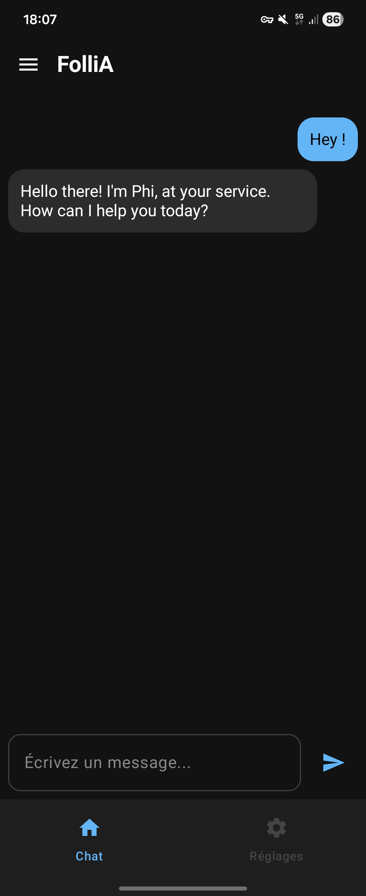
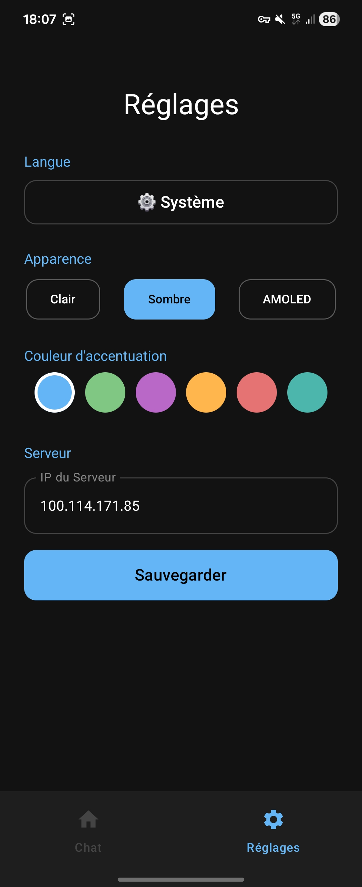

# 🧠 FollIA - Assistant Neuronal Privé

**FollIA** est un client Android léger, épuré et hautement personnalisable conçu pour interagir avec vos modèles de langage locaux (LLM) via **[Ollama](https://ollama.com/)**. 

Parce qu'il faut un peu de folie pour vouloir faire tourner une IA dans sa poche, mais beaucoup de sérieux pour le faire de manière 100% privée.

## 📸 Captures d'écran

  
  

## ✨ Fonctionnalités Principales
- **100% Privé (Edge AI)** : Tout le traitement reste sur votre réseau local ou VPN. Pas de cloud, pas d'abonnements, pas de collecte de données.
- **Détection Automatique Intelligente** : Entrez l'IP de votre serveur, et FollIA scanne et se connecte automatiquement à l'IA active sur votre machine (Llama3, Phi, Mistral...). Aucune configuration manuelle du modèle n'est requise !
- **Compatible VPN** : Accédez à votre serveur domestique (PC, Raspberry Pi) de n'importe où en utilisant votre connexion 5G et un VPN.
- **Interface Personnalisable** : Adoptez votre propre style avec les thèmes Clair, Sombre ou véritable AMOLED, et plusieurs couleurs d'accentuation.

## 📱 Configuration Minimale
**Pour l'appareil Android :**
- Android 8.0 (API 26) ou version ultérieure.
- Connexion réseau active (Wi-Fi local ou données mobiles via VPN).

**Pour le Serveur Hôte :**
- Un ordinateur ou nano-ordinateur (ex: Raspberry Pi 4/5) faisant tourner [Ollama](https://ollama.com/).
- Minimum 4 Go de RAM (8 Go+ fortement recommandés pour faire tourner des modèles comme *Llama3* ou *Phi3* de manière fluide).

## 🚀 Démarrage Rapide

### Prérequis
1. Vous devez avoir **Ollama** en cours d'exécution sur un ordinateur ou un serveur.
2. Votre appareil Android doit être sur le même réseau que le serveur.
3. *(Important)* Assurez-vous qu'Ollama est configuré pour écouter les connexions externes en définissant la variable d'environnement `OLLAMA_HOST=0.0.0.0` sur votre serveur.

### Installation
1. Allez sur la page des **[Releases](../../releases)**.
2. Téléchargez le dernier fichier `FolliA_v0.6.apk`.
3. Installez l'APK sur votre appareil Android.
4. Ouvrez **FollIA**, allez dans les Réglages ⚙️, et entrez l'adresse IP de votre serveur.

### La V1.0 arrive bientôt avec de nombreux changements !

## 📜 Licence
Ce projet est sous licence **GNU General Public License v3.0** - voir le fichier [LICENSE](LICENSE) pour plus de détails.
