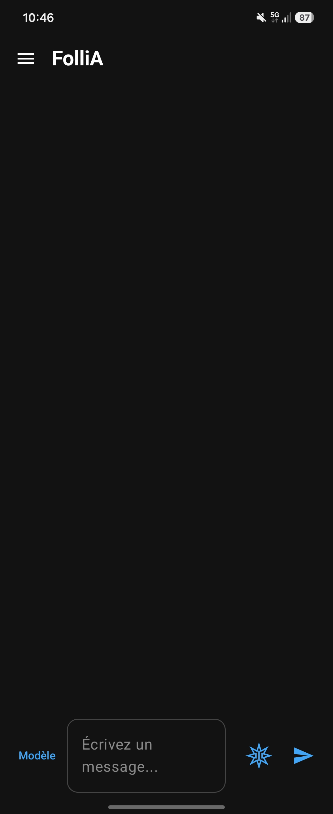
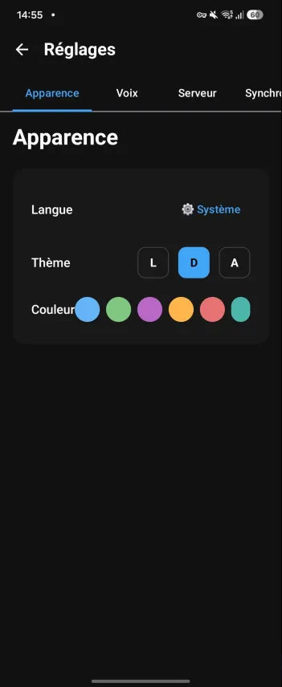
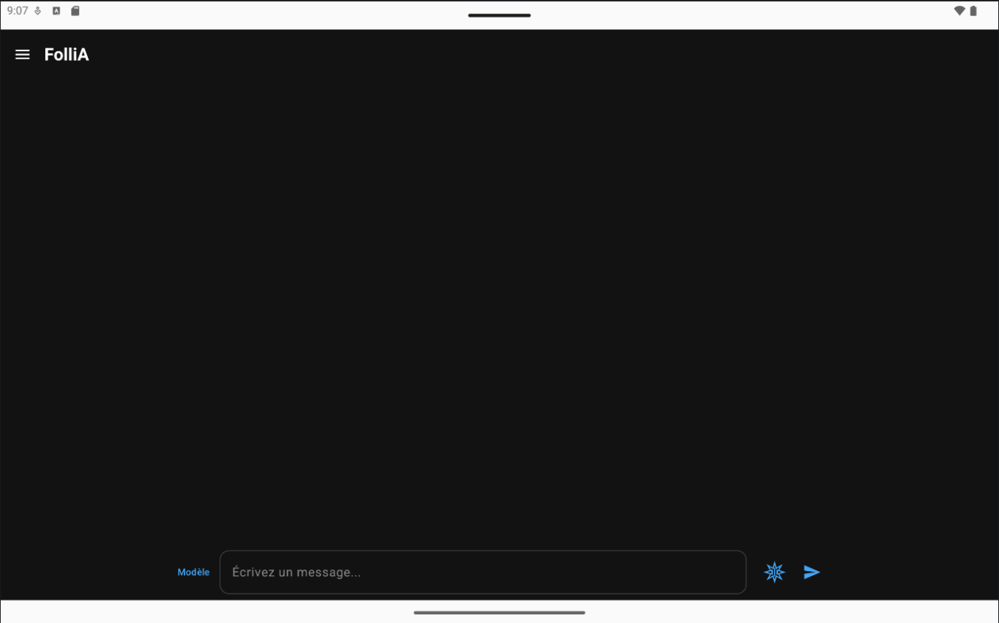
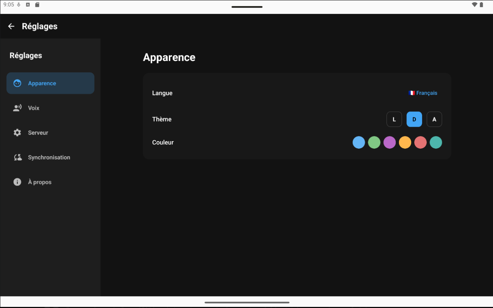

# 🧠 FolliA - Local and Native AI. Uncompromising Privacy.

🌍 **[Visit the Official FolliA Website](https://iamtheamn.github.io/FolliA-website/)**

**FolliA** is a lightweight, native, and 100% private Android client designed to interact with your local Large Language Models (LLMs) via **[Ollama](https://ollama.com/)**. 

Because it takes a little madness to want to run an AI in your pocket, but a lot of seriousness to do it privately and securely.

## 📸 Screenshots

  
📱 <b>View Phone Interface (Click to expand)</b>

   
  

    
    
  

  
💻 <b>View Tablet Interface (Click to expand)</b>

   
  

    
      
    
  

## ✨ Core Features
- 🔄 **True Background Persistence:** Switch apps freely. The text generation continues flawlessly in the background without any interruptions.
- 🎙️ **Hands-Free Voice Conversations:** Talk naturally with your AI using an optimized audio engine with zero echo feedback.
- ☁️ **Data Sovereignty & Nextcloud Sync:** Export your chats locally or sync them entirely privately via WebDAV (Nextcloud).
- 🛡️ **100% Private & Standalone:** All processing stays on your local network. Connect remotely using your own VPN setup. No third-party clouds, absolutely zero telemetry.

## 📱 Minimum Requirements
**For the Android Device:**
- Android 8.0 (API 26) or higher.
- Active network connection (Local Wi-Fi or mobile data via VPN).

**For the Host Server:**
- A computer or SBC (like a Raspberry Pi) running [Ollama](https://ollama.com/).
- Minimum 4GB of RAM (8GB+ highly recommended for recent models).

## 🚀 Getting Started

### Prerequisites
1. **Ollama** must be running on your server.
2. Your Android device must be able to reach the server (same network or VPN).
3. *(Important)* Ensure Ollama is configured to listen to external IPs by setting the environment variable `OLLAMA_HOST=0.0.0.0` on your host machine.

### Installation
1. Go to the project's **[Releases](../../releases)** page.
2. Download the `.apk` file for the latest available version.
3. Install the APK on your Android device.
4. Open **FolliA**, go to Settings ⚙️, and enter your server's IP address.

## 🤝 Support the project
FolliA is developed entirely independently. If you find the app useful, consider leaving a ⭐ on this repository or buying me a coffee:

## 📜 License
This project is licensed under the **GNU General Public License v3.0** - see the [LICENSE](LICENSE) file for details.
